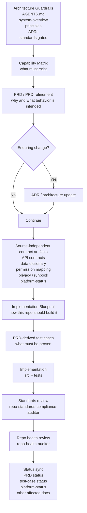
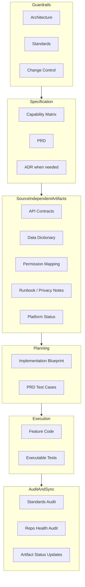

# Build-From-Spec Change Harness

## Purpose

Describe the implementation harness this repo is building around change work so
that a future project can be driven from specs and controlled artifacts rather
than from existing feature code alone.

This document answers two questions:

1. what are the implementation steps
2. how does the surrounding harness prevent drift, contamination,
   contradiction, and overlap

## Visual Overview

## Layered Harness

## Implementation Steps

1. Start from architecture and standards guardrails.
   This defines what kinds of change are allowed and what evidence is required.
2. Define the capability set.
   The capability matrix records what the platform or slice must do.
   It should also classify each capability boundary as `root`, `tenant`, or
   explicitly approved shared-cross-tenant, plus the tenant-context rule when
   relevant.
3. Write or refine the PRD.
   The PRD captures the intended behavior, actors, and scope.
4. Add an ADR when the change is enduring.
   Shared seams, lasting patterns, and cross-cutting rules should not live only
   in implementation.
5. Create or refresh source-independent artifacts.
   This includes API contracts, persistence contracts, permission mapping,
   privacy notes, runbooks, and platform standards snapshots where relevant.
6. Translate the approved scope into an implementation blueprint.
   The blueprint explains how this repo should build the slice.
   If the PRD or source-independent contract artifacts are materially reset
   later in the same loop, refresh the blueprint before continuing.
7. Derive PRD test cases.
   This turns intended behavior into an explicit verification inventory.
8. Implement the change in `src/` and `tests/`.
   Do not silently override reviewed PRD-derived test cases while writing
   executable tests; if case IDs, grouping, lifecycle, or intended behavior
   need to change, update the PRD test-case artifact first and re-review it.
   When persistence-backed behavior is added, also refresh the shared
   persistence harness and scripts in the same loop.
9. Run standards and repo-health review.
10. Update status-bearing artifacts so the repo does not keep stale planning or
    stale compliance posture summaries.
    This includes architecture summaries, source-independent docs, OpenAPI,
    feature docs, and platform-status snapshots whose truth changed during the
    slice.

## What Each Artifact Is For

- Capability matrix:
  Inventory of what must exist across a capability set.
- PRD:
  Functional intent, scope, actors, rules, and outcomes.
- ADR:
  Lasting architectural decisions and cross-cutting patterns.
- API contracts:
  Source-independent route and middleware behavior.
- Data dictionary:
  Source-independent persistence and entity behavior.
- Permission mapping:
  Source-independent authorization model when the change is permission
  sensitive.
- Implementation blueprint:
  Repo-shaped build plan for one approved slice.
- PRD test cases:
  Verification plan with stable test IDs and layers.
- Platform status:
  Current standards posture snapshot for the platform, not just the proposed
  change.

## How The Harness Prevents Drift

Drift happens when code, tests, and docs evolve separately and nobody notices.

This harness reduces drift by:

- using a clear authority order:
  `AGENTS.md`, architecture docs, ADRs, PRDs, code, tests, and then
  source-independent artifacts
- requiring source-independent docs for routes and persistence, so important
  behavior is not trapped only in implementation files
- deriving tests from the PRD rather than treating tests as ad hoc afterthoughts
- keeping PRD-derived test cases under change control during implementation, so
  reviewed verification intent is not silently redefined in code
- forcing status updates after implementation so planned and implemented work do
  not quietly diverge
- forcing downstream artifact refresh after upstream resets, so blueprint and
  verification work do not keep stale assumptions after a PRD or contract
  rewrite
- maintaining `docs/standards/platform-status/` as the current baseline rather
  than leaving standards posture implicit
- using standards and repo-health audits as explicit end-of-loop checks
- requiring persistence-harness follow-through when a feature adds migration or
  storage-backed verification responsibilities

## How The Harness Prevents Contamination

Contamination happens when concerns leak across boundaries, for example when
feature code takes shortcuts through another feature's private persistence seam,
or when planning artifacts start doing each other's jobs.

This harness reduces contamination by:

- keeping architecture and change-control rules above implementation choices
- separating artifact responsibilities:
  matrix, PRD, ADR, contract docs, blueprint, test cases, code, and audits each
  answer a different question
- making implementation blueprints repo-shaped, so changes are planned through
  the approved seams instead of through convenient shortcuts
- documenting cross-feature reads explicitly in API contracts and the data
  dictionary
- distinguishing maintainer skills from auditor skills, so “create/update” and
  “check for drift” are not silently mixed together

## How The Harness Prevents Contradiction

Contradiction happens when two artifacts claim different truths and the repo has
no rule for resolving them.

This harness reduces contradiction by:

- defining authority order in the skills and in the architecture layer
- requiring ADRs for enduring changes so shared rules do not fork across PRDs
  and implementation
- making docs-alignment and standards audits compare sources instead of
  rewriting around mismatches silently
- letting platform-status snapshots record current posture with
  `Pass`, `Partial`, `Fail`, `Not Assessed`, and `Not Applicable`, which makes
  uncertainty visible instead of hiding it
- requiring maintainers to surface wider artifact impact when a contract or
  persistence change should also move standards or blueprint artifacts

## How The Harness Prevents Overlap

Overlap happens when multiple artifacts try to own the same concern and the
team stops knowing which one to trust.

This harness reduces overlap by assigning each artifact a primary role:

- capability matrix = what must exist
- implementation blueprint = how this repo should build it
- PRD = intended behavior and scope
- ADR = enduring design decision
- API contract = external/backend route behavior
- data dictionary = persistence and entity behavior
- PRD test cases = verification inventory
- platform status = current standards baseline

The skills mirror this separation:

- maintainers create or refresh specific artifact classes
- auditors compare, classify, and report drift
- the change-loop orchestrator coordinates the full path end to end

## Practical Rule

A change is healthier when:

- the intended behavior is visible before coding
- the repo-shaped plan is visible before coding
- the verification inventory is visible before coding
- the source-independent contract survives even if feature code disappears
- the standards posture is updated when the platform baseline changes

If any one of those is missing, the repo becomes easier to build quickly but
harder to rebuild safely later.
