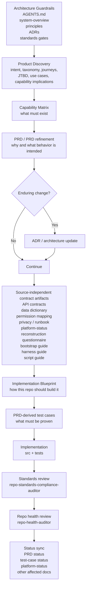

# Build-From-Spec Change Harness

## Purpose

Describe the implementation harness this repo is building around change work so
that a future project can be driven from specs and controlled artifacts rather
than from existing feature code alone.

The goal is functional and compliance-aligned reconstruction, not exact
source-file reproduction. A successful rebuild should satisfy the same
business outcomes, NFRs, architecture boundaries, and standards obligations
even if internal code structure differs.

This document answers two questions:

1. what are the implementation steps
2. how does the surrounding harness prevent drift, contamination,
   contradiction, and overlap

## Visual Overview

## Layered Harness

```mermaid
flowchart TB
    subgraph Guardrails
      A1[Architecture]
      A2[Standards]
      A3[Change Control]
    end

    subgraph ProductDiscovery
      P1[Taxonomy Classification]
      P2[Product Template Fit]
      P3[Journey / JTBD / Use Cases]
      P4[Product Discovery Packet]
    end

    subgraph Specification
      B1[Capability Matrix]
      B2[PRD]
      B3[ADR when needed]
    end

    subgraph SourceIndependentArtifacts
      C1[API Contracts]
      C2[Data Dictionary]
      C3[Permission Mapping]
      C4[Runbook / Privacy Notes]
      C5[Platform Status]
      C6[Reconstruction Questionnaire]
      C7[Bootstrap And Helper Guide]
      C8[Test Harness Internals]
      C9[Script And Helper Behavior]
    end

    subgraph Planning
      D0[Story Breakdown\nsmallest deliverable/verifiable stories]
      D1[Task Breakdown\nisolated delivery tasks]
      D2[Implementation Blueprint]
      D3[PRD Test Cases]
    end

    subgraph Execution
      E1[Feature Code]
      E2[Executable Tests]
    end

    subgraph AuditAndSync
      F1[Standards Audit]
      F2[Repo Health Audit]
      F3[Artifact Status Updates]
    end

    Guardrails --> ProductDiscovery
    ProductDiscovery --> Specification
    Specification --> SourceIndependentArtifacts
    SourceIndependentArtifacts --> Planning
    Planning --> Execution
    Execution --> AuditAndSync
```

## Implementation Steps

1. Start from architecture and standards guardrails.
   This defines what kinds of change are allowed and what evidence is required.
2. Run Product Discovery when the request is product-shaped,
   pre-requirements, template-seeking, a new feature family, a material
   vertical slice, or feedback that may change product intent.
   When the user asks to use Layer 1 or Product Discovery to define a
   requirement, start with a plain-language summary and a focused interview
   before repo inspection, preflight, PRD drafting, implementation planning, or
   design-system work-item discovery. Product Discovery then classifies the
   request through the taxonomy, selects a product template when one fits,
   records user journeys, bridges those journeys through multi-actor
   job-to-be-done and use case statements, derives product-level capability
   implications, captures context variations and unhappy paths, captures open
   business questions, and sets the handoff status for Technical Steering.
   If product intent is blocked or no existing family/template fits, stop
   before PRD, capability matrix, or implementation planning until the packet
   records the required decision or steering path.
3. Define the capability set.
   The capability matrix records what the platform or slice must do.
   It should also classify each capability boundary as `root`, `tenant`, or
   explicitly approved shared-cross-tenant, plus the tenant-context rule when
   relevant.
4. Write or refine the PRD.
   The PRD captures the intended behavior, actors, and scope.
5. Add an ADR when the change is enduring.
   Shared seams, lasting patterns, and cross-cutting rules should not live only
   in implementation.
   Before deciding whether a new ADR is needed, run an explicit ADR discovery
   pass. Search `docs/architecture/adr/` for each proposed change area, list
   the exact ADR files reviewed in the steering, PRD, blueprint, or close-out
   artifact, and record `no existing ADR found` for any enduring decision area
   with no match. If no matching ADR exists, either propose a new ADR or record
   why the slice does not require one. If an existing ADR conflicts with the
   current implementation plan, steering packet, PRD, source-independent
   contract, or another ADR, stop and surface the conflict before
   implementation continues.
6. Create or refresh source-independent artifacts.
   This includes API contracts, persistence contracts, permission mapping,
   privacy notes, runbooks, platform standards snapshots, reconstruction
   questionnaire updates, bootstrap or helper docs, test harness internals, and
   script or helper behavior docs where relevant.
7. For material work, Technical Steering decides architectural posture before
   Story Breakdown. It classifies scope elements as feature-local,
   feature-public-seam, platform-seam, shared-lib-candidate,
   design-system-seam, architecture-foundation-required, or blocked. This is
   the first authoritative decision about shared versus feature-specific work.
8. For material work that has gone through Technical Steering, run Story
   Breakdown before Task Breakdown or Delivery.
   Story Breakdown converts approved steering into the smallest independently
   deliverable and verifiable stories. It records each story's job to be done,
   value type, delivery shape, acceptance criteria, dependency and feature-seam
   map, capability-matrix posture, proof obligations, and artifact ledger.
   Story Breakdown does not replace PRDs, capability matrices, PRD-derived
   test cases, or implementation blueprints.
9. Run Task Breakdown for one approved story, or a small explicitly related
   story set, before Delivery.
   Task Breakdown preserves story acceptance criteria, capability rows, proof
   obligations, dependencies, artifact ledger, and blockers while creating
   isolated tasks with allowed write sets, branch/worktree/bootstrap strategy,
   task-type guardrail approval, code-placement and extraction review, proof
   commands, structured guardrail evidence, allowed write-set classification,
   forbidden work, and Layer 5 handoff status. It does not redefine story
   scope, acceptance criteria, product intent, or Technical Steering
   architecture.
10. Translate the approved scope into an implementation blueprint.
   The blueprint explains how this repo should build the slice.
   If the PRD or source-independent contract artifacts are materially reset
   later in the same loop, refresh the blueprint before continuing.
11. Derive PRD test cases.
   This turns intended behavior into an explicit verification inventory.
12. Implement the change in `src/` and `tests/`.
   Do not silently override reviewed PRD-derived test cases while writing
   executable tests; if case IDs, grouping, lifecycle, or intended behavior
   need to change, update the PRD test-case artifact first and re-review it.
   When persistence-backed behavior is added, also refresh the shared
   persistence harness and scripts in the same loop.
13. Run standards and repo-health review.
14. Update status-bearing artifacts so the repo does not keep stale planning or
    stale compliance posture summaries.
    This includes architecture summaries, source-independent docs, OpenAPI,
    feature docs, and platform-status snapshots whose truth changed during the
    slice, plus reconstruction-questionnaire, bootstrap-guide, harness-guide,
    and script-guide surfaces when runtime assumptions or helper requirements
    changed.

## What Each Artifact Is For

- Product Discovery packet:
  Product intent, taxonomy classification, template fit, journeys,
  job-to-be-done bridge, use cases, product capability implications, open
  business questions, out-of-scope boundaries, ambiguity ledger, feedback
  posture, and handoff readiness for Technical Steering. It does not decide
  implementation architecture.
- Technical Steering packet:
  Layer 2 architecture classification for the approved product scope. It
  decides feature-local versus shared/platform posture, feature public seams,
  shared-library candidates, design-system seams, architecture-foundation
  blockers, deterministic signal checks, risk flags, compatibility strategy,
  and required downstream Layer 3 signals and Layer 4 task types. It does not
  split stories or implementation tasks.
- Story Breakdown packet:
  Layer 3 queue of the smallest independently deliverable and verifiable
  stories from approved Technical Steering. It records value type, delivery
  shape, job to be done, acceptance criteria, dependency and seam mapping,
  capability-matrix posture, proof obligations, steering architecture
  classification snapshot, task-type signal matrix, and artifact ledger before
  Task Breakdown or Delivery begins. It does not decide implementation
  architecture or write detailed `TC-*` test cases.
- Task Breakdown packet:
  Layer 4 queue of isolated tasks from one approved Story Breakdown story, or a
  small explicitly related story set. It records parent story, acceptance
  criteria coverage, capability rows, allowed write set, non-goals,
  dependencies, shared seams, task-type guardrail approval, code-placement and
  extraction review, structured guardrail evidence, allowed write-set
  classification, forbidden work, artifact obligations, proof commands, branch
  / worktree / bootstrap strategy, blockers, and Layer 5 Delivery handoff
  status. It does not redefine story scope or invent architecture.
  `platform-seam` is a Layer 4 task type, not a Layer 3 story delivery shape;
  it should normally derive from a `system-value`, `refactor-first`,
  `architecture-foundation`, `standards-compliance`, or `vertical-slice` story
  whose approved scope requires shared runtime, routing, tooling, harness, or
  generated-artifact machinery.
- Capability matrix:
  Inventory of what must exist across a capability set.
- PRD:
  Functional intent, scope, actors, rules, and outcomes.
- ADR:
  Lasting architectural decisions and cross-cutting patterns.
- API contracts:
  Source-independent route and middleware behavior.
- Data dictionary:
  Source-independent persistence and entity behavior.
- Permission mapping:
  Source-independent authorization model when the change is permission
  sensitive.
- Reconstruction questionnaire:
  Source-independent record of interchangeable tools, providers, and
  deployer-local choices without storing live secrets.
- Bootstrap and helper guide:
  Source-independent record of startup order, helper scripts, and runnable
  local assumptions.
- Test harness internals:
  Source-independent record of reusable harness seams, fixture factories, and
  persistence-test support structure.
- Script and helper behavior:
  Source-independent record of script purpose, inputs, side effects, and local
  helper utility behavior.
- Implementation blueprint:
  Repo-shaped build plan for one approved slice.
- PRD test cases:
  Verification plan with stable test IDs and layers.
- Platform status:
  Current standards posture snapshot for the platform, not just the proposed
  change.

## Product Discovery Layer

Layer 1 exists to prevent vague product requests from becoming premature
technical planning work.

Product Discovery has three operating modes:

- Discovery conversation:
  Use when the user asks to use Layer 1 or Product Discovery to define, shape,
  explore, or clarify a requirement. This mode is not a material repo edit.
  Start with a plain-language summary and focused product questions. Do not
  begin with git preflight, branch/worktree state, broad repo inspection, PRD
  drafting, implementation planning, or design-system work-item discovery. Do
  not create or fill a packet until the requester has seen the summary and has
  answered, corrected, or explicitly deferred the first question set. Do not
  use a first-pass-draft-then-questions pattern when important product
  questions are already known.
- Draft fast path:
  Use only when the user explicitly asks for a draft Product Discovery packet,
  draft discovery packet, discovery pack, or product discovery packet. This
  path targets 30 seconds or less, reads only directly relevant Product
  Discovery files, writes exactly the requested packet, and intentionally skips
  git preflight, branch/bootstrap/worktree checks, maintained-artifact sweeps,
  broad architecture-doc inspection, and broad repo searches.
- Governed mode:
  Use when the user asks for validated, governed, complete,
  implementation-ready, artifact-complete, promotion-ready, or similar output.
  Governed mode uses the normal repo start gates and artifact requirements.

Draft fast path output is draft-only and must not be described as validated,
governed, complete, implementation-ready, artifact-complete, or
promotion-ready.

Inputs:

- user change request
- post-iteration feedback
- prior Product Discovery packets
- product taxonomy and product templates
- relevant PRDs, feature docs, retrospectives, or workspace notes

Outputs:

- Product Discovery packet using
  `docs/templates/product-discovery-packet-template.md`
- optional feedback note using
  `docs/templates/product-discovery-feedback-template.md`
- taxonomy or product-template maintenance signal when existing reuse paths do
  not fit

Handoff to Technical Steering:

- locked product decisions
- intentionally deferred product decisions
- taxonomy classification
- product template fit or new-family candidate
- user journey, multi-actor job-to-be-done, use cases, context variations,
  unhappy paths, and product capability implications
- ambiguity and assumption ledger
- risk flags for permission, tenant boundary, governed frontend, UX/design
  system, assets, reporting, persistence, async jobs, external providers,
  privacy, and compliance

Stop conditions:

- `blocked-product-intent`: core business or user intent is unresolved.
- `blocked-new-template-approval`: a reusable product template appears needed
  before requirements should lock.
- `blocked-new-family-steering`: no existing family/template fits, and
  Technical Steering or design-system governance must decide the new family or
  extension path.

Product Discovery may identify a new-family candidate, new UX pattern
candidate, or design-system extension signal, but it does not approve the
architecture, design-system pattern, or implementation path.

## How The Harness Prevents Drift

Drift happens when code, tests, and docs evolve separately and nobody notices.

This harness reduces drift by:

- using a clear authority order:
  `AGENTS.md`, architecture docs, ADRs, PRDs, code, tests, and then
  source-independent artifacts
- requiring exact ADR discovery instead of a vague "relevant ADRs" sweep:
  every implementation loop must search the ADR directory for the scoped
  change areas, list the ADR files reviewed, record missing ADR coverage for
  enduring decisions, and stop on ADR conflicts that would change the selected
  architecture or shared seam
- requiring source-independent docs for routes and persistence, so important
  behavior is not trapped only in implementation files
- deriving tests from the PRD rather than treating tests as ad hoc afterthoughts
- keeping PRD-derived test cases under change control during implementation, so
  reviewed verification intent is not silently redefined in code
- forcing status updates after implementation so planned and implemented work do
  not quietly diverge
- forcing downstream artifact refresh after upstream resets, so blueprint and
  verification work do not keep stale assumptions after a PRD or contract
  rewrite
- maintaining `docs/standards/platform-status/` as the current baseline rather
  than leaving standards posture implicit
- using standards and repo-health audits as explicit end-of-loop checks
- requiring persistence-harness follow-through when a feature adds migration or
  storage-backed verification responsibilities

## How The Harness Prevents Contamination

Contamination happens when concerns leak across boundaries, for example when
feature code takes shortcuts through another feature's private persistence seam,
or when planning artifacts start doing each other's jobs.

This harness reduces contamination by:

- keeping architecture and change-control rules above implementation choices
- separating artifact responsibilities:
  matrix, PRD, ADR, contract docs, blueprint, test cases, code, and audits each
  answer a different question
- making implementation blueprints repo-shaped, so changes are planned through
  the approved seams instead of through convenient shortcuts
- documenting cross-feature reads explicitly in API contracts and the data
  dictionary
- distinguishing maintainer skills from auditor skills, so “create/update” and
  “check for drift” are not silently mixed together

## How The Harness Prevents Contradiction

Contradiction happens when two artifacts claim different truths and the repo has
no rule for resolving them.

This harness reduces contradiction by:

- defining authority order in the skills and in the architecture layer
- requiring ADRs for enduring changes so shared rules do not fork across PRDs
  and implementation
- making docs-alignment and standards audits compare sources instead of
  rewriting around mismatches silently
- letting platform-status snapshots record current posture with
  `Pass`, `Partial`, `Fail`, `Not Assessed`, and `Not Applicable`, which makes
  uncertainty visible instead of hiding it
- requiring maintainers to surface wider artifact impact when a contract or
  persistence change should also move standards or blueprint artifacts

## How The Harness Prevents Overlap

Overlap happens when multiple artifacts try to own the same concern and the
team stops knowing which one to trust.

This harness reduces overlap by assigning each artifact a primary role:

- capability matrix = what must exist
- implementation blueprint = how this repo should build it
- PRD = intended behavior and scope
- ADR = enduring design decision
- API contract = external/backend route behavior
- data dictionary = persistence and entity behavior
- PRD test cases = verification inventory
- platform status = current standards baseline

The skills mirror this separation:

- maintainers create or refresh specific artifact classes
- auditors compare, classify, and report drift
- the change-loop orchestrator coordinates the full path end to end

## Practical Rule

A change is healthier when:

- the intended behavior is visible before coding
- the repo-shaped plan is visible before coding
- the verification inventory is visible before coding
- the source-independent contract survives even if feature code disappears
- the standards posture is updated when the platform baseline changes

If any one of those is missing, the repo becomes easier to build quickly but
harder to rebuild safely later.
